# Bet Tracker

Bet Tracker is a full-stack, responsive website built for football supports who enjoy betting on matches. The site is for bet tracking purposes and all monetary amounts on the site are for documentation purposes only. 
 
It provides users with the opportunity to share their upcoming bets with the community, and see how their results fare against other like-minded bettors. 

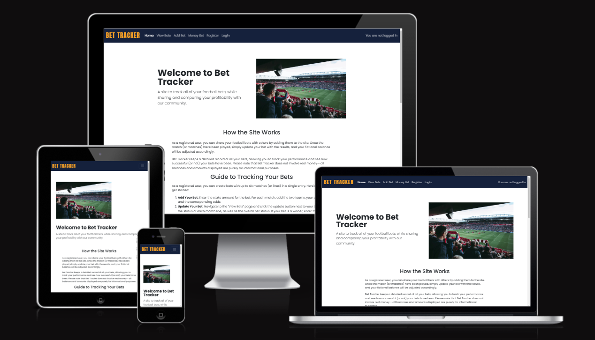

View the live website [here](https://track-my-bets-1ee4e00d237a.herokuapp.com/)
____

(Note, throughout this readme, the terms 'match' and 'line' are used interchangeably. One bet can contain many matches or lines)

## Overview

Bet Tracker is a responsive website compatible with all current major browsers. It is built for educational purposes using Bootstrap and the Django Framework. It consists of user authentication and permission logic, with full CRUD functionality on bets entered on the site. 

The site is aimed at betting and football enthusiasts who want to add an extra element to their betting by sharing their bets with the community, and comparing their success too. Part of responsible gambling is to keep a track of all your bets, successful or not, and this site helps to achieve this. 

## User Expectations

- The app should be easy to navigate and all betting information displayed intelligently.
- The user should be able to create, read, update and delete any football bets they want to track.
- The user should be able to compare their betting success with other users.
- The user should be able to view bets places by other users on the site.
- The app should be fully tested and run without bugs.

## Agile Methodology

The workflow for planning and implementing this project was carried out using Agile Methodology. I created a Project within GitHub and used GitHub Issues to record the Epics and User Stories. Milestones were used to manage iterations of development, and labels were used to categorise the user stories and structure the prioritisation of work. 

Each User Story contains Acceptance Criteria which sometimes was adjusted throughout the process of completing the user story. This flexibility benefitted the project by constantly ensuring the acceptance criteria were tailored towards the goal of the user story.

Estimating the effort behind each user story was a challenge, so the workload of each milestone was varied.

The MoSCoW Method of Prioritisation was used, classifying each User Story as a 'Must Have', 'Should Have' or 'Could Have'. All 'Must Have' stories were successfully completed, while there were some remaining user stories labelled 'Could Have' that were not implemented. These User Stories (#15, #16, #29) remain in the Optional list of tasks to be implemented in a future iteration. 

### Epics

 - #1 As a superuser I want to add a bet via the admin page and view it on the site.
 - #9 This Epic covers all the user stories required for the features associated with the Bet app functionality
 - #17 Epic to cover all User Stories for the Bank App features
 - #18 Epic to cover all user stories linked to account registration and login / logout process

### User Stories

List of User Stories

 - #2 As a developer, I want to create a Django Project in the IDE, so that I have the framework for the Bet Tracker project
 - #3 As a developer, I want to have a Bet app created in the Django project to facilitate the bet tracking element of the project
 - #4 As a developer, I want to have a Bank app in the Django project to facilitate the money tracking and user ranking elements of the project
 - #5 As a project, I want to be deployed to Heroku, so that I am available to all potential users.
 - #6 As a developer, I want to set up and configure my database and Bet app models, so that data can be added via the admin page
 - #7 As a superuser I want to have an admin page that is customised to the project, so that the data and admin functions are presented in an intelligent way
 - #8 As a user, I want to view all open bets so that I can see what other users bets are upcoming
 - #10 As a user, I want to have consistent styling across all pages so that the site is accessible and familiar
 - #11 As a user, I want to view all settled bets so that I can review all previous betting activity
 - #12 As a user, I want to add a bet to the site so that share with others and track my success
 - #13 As a user, I want to edit my open bets so that update the result, status and make any necessary corrections
 - #14 As a user, I want to delete an open bet so that the bet details are removed from the database
 - #19 As a visitor, I want to register to the site so that i can use the site and track my bets
 - #20 As a user, I want to login to the site so that I can make changes to my bets, and make new bets
 - #21 As a user, I want to logout of the site so that my account is not logged in when i am not using the site
 - #22 As a user, I want to **view all user bank amounts so that I can see where I rank in the community
 - #23 As a user, I want to see information presented intelligently and cleanly on the site so that the site is easy to read
 - #24 As a user, I want to see my account balance on the homepage so that i know how successful my bets are
 - #25 As a user, I want to see the deployed project with intended styling so that I view the site as intended
 - #26 As a user I want to add multiple lines to my new bet so that I can place accumulator bets on more than one match at a time.
 - #27 As a tester, I want to automate tests to the bet form function so that i can ensure the functions work as expected
 - #28 As a user, I want to track my betting account balance so that I can see how profitable my bets are
 - #30 As a user, I want to view a home page that explains how to use the site so that a casual viewer unfamiliar with betting can use the site
 - #31 As a user, I want to view a responsive and consistently styled site so that the user experience is a good one when using the site

## Wireframes

The idea of the website was to keep the data very clean and presented to the user in a uniform design. Therefore, the wireframes are very simplistic in line with the intended design.
The wireframe image of the Edit Bet page shows that the original intention was to display the match edit bet.

Wireframes

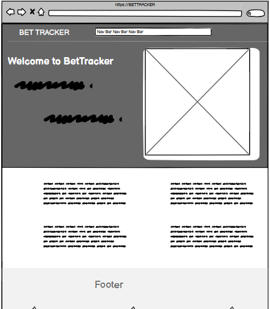

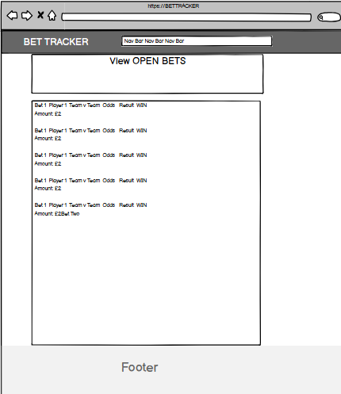

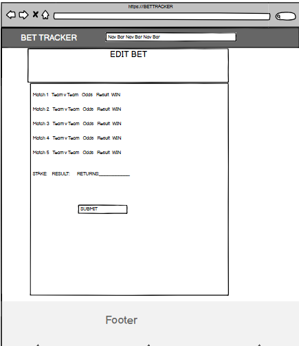

## Website Structure

### Homepage
The homepage welcomes users to the site and gives them a clear overview of the sites purpose. For visitors unfamiliar with betting, a clear description of football betting and how odds work is provided.

### View Bets
The View Bets page gives users a complete one-page view of all bets on the site. Bets are split into categories, "Open" and "Settled". Open bets are for upcoming matches and users are sharing their bets and predictions with each other. Users can gain insight and inspiration by knowing how other successful bettors are thinking about a certain match. The "Settled Bet" list is a historical record of all bets that have been settled.

### Add a Bet
A logged in user can add a new bet to the site at any time. The site allows up to 6 matches (lines) to be combined into a single bet.

### Update a Bet
While a bet is still open, the user can edit all details of their bet. This can either be to correct a mistake, remove a cancelled fixture, or to enter the match result and update the bet status after the match(es) has been played.

### Money List
The money list page allows users to see the ranking of their account balance compared to other users on the site. 

## Administration
The administration pages all the site administrator a convenient and intuitive way to manage the database, and in turn the data displayed on the site. The administrator can amend individual bets, lines, or user's bank balance and search for each on the site in an intelligent way.

## Database structure

### **User**

(Django Model)

| Field Name  | Field Type   | Key         |
|-------------|--------------|-------------|
| id          | Integer      | Primary Key |
| username    | CharField    | -           |
| email       | EmailField   | -           |

---

### **Bet**

| Field Name      | Field Type    | Key            |
|------------------|---------------|----------------|
| id              | UUIDField     | Primary Key    |
| punter          | ForeignKey    | Foreign Key (to User) |
| created_on      | DateTimeField | -              |
| updated_on      | DateTimeField | -              |
| stake           | DecimalField  | -              |
| status          | IntegerField  | -              |
| settled_amount  | DecimalField  | -              |

---

### **Line**

| Field Name     | Field Type    | Key            |
|----------------|---------------|----------------|
| id             | AutoField     | Primary Key    |
| bet            | ForeignKey    | Foreign Key (to Bet) |
| home_team      | CharField     | -              |
| away_team      | CharField     | -              |
| prediction     | IntegerField  | -              |
| odds           | DecimalField  | -              |
| match_result   | IntegerField  | -              |
| status         | IntegerField  | -              |
| created_on     | DateTimeField | -              |
| updated_on     | DateTimeField | -              |

---

### **Bank**

| Field Name  | Field Type    | Key            |
|-------------|---------------|----------------|
| id          | AutoField     | Primary Key    |
| user        | ForeignKey    | Foreign Key (to User) |
| updated_on  | DateTimeField | -              |
| balance     | DecimalField  | -              |
| is_active   | BooleanField  | -              |

### Relationship Diagram

Click to view diagram

 
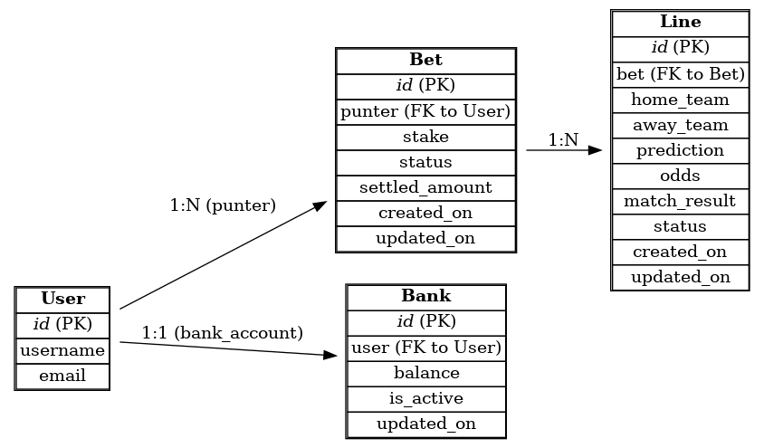

-----

## Styling

The website is designed with minimalist intent to keep the pages clean and with the important data clearly visible. 

### Fonts
I used Google fonts to source the two fonts I used for this website.
Anton was chosen for the brand name in the heading, making it stand out from the other text.
Poppins was chosen as the font for all other text as it is a sans-serif font that displays numbers in a clear style. The site contains a lot of numbers so it was important to choose the font accordingly. 

### Colours

I chose the colour palette using the [Coolers](https://coolors.co/) . These colours work well together and give the site a modern and professional look. 

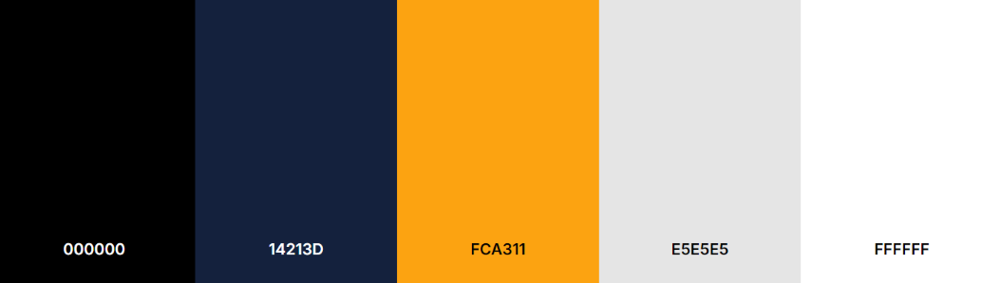

-----

## Features

**Header and Navigation**

The header and navigation bar are contained within the base template so that all pages on the site inherit the same design. The Bet Tracker brand name is an anchor tag which brings the user back to the home page whenever clicked.
The Navigation bar contains links to the "View Bets", "Add Bet", "Money List", "Login", "Logout" and "Register".
On smaller screens, the navigation bar condenses into a hamburger button, which when pressed, displays the navigation options vertically. 
The links have an active class assigned to them, styling the active-page link differently so the user always knows where within the site they are.
The links for "Registration", "Login" and "Logout are displayed dynamically and respond to the status of the current user. 
At the right-hand side of the header is a statement confirming the username of the user currently logged in. This is visible on every page to reassure the user they are both logged in, and under which account.

Click to view screenshots of Navigation

 
 - Large Screen
 
 - 

 - Mobile Screen
 
 - 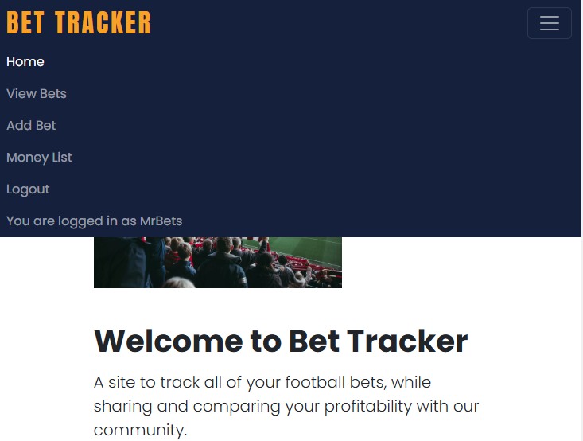

**Footer**
Featured on all pages as part of the base template, the footer contains information about me as the site creator and provides a way to get in contact. Links to my email and to my Github page are both included.
The footer is styled in a minimalistic way to present the information clearly and concisely. All links are labelled for enhanced accessibility. 

Click to view screenshots of the Footer

 - Footer
 
 - 

**Home Page**
The home page welcomes the user or visitor and explains the purpose of the website. A photo of a football match is displayed as an instant prompt to the user as to what the website is focussed on. 
A section for how to use the website is included, which details the process of adding a bet and updating a bet.
For users or guest unfamiliar with betting, a short introductory guide offers them an explanation for how betting works, and what the terminology of the site means. 
This information makes the site accessible to all visitors, whatever their betting experience and knowledge. 
The home page also confirms to the user that all monetary amounts displayed on the site are purely fictional, and for information purposes only.
The page is fully responsive and is readable on both mobile devices and large screens.

Click to view screenshots of the Home Page

- Home Top Page
 
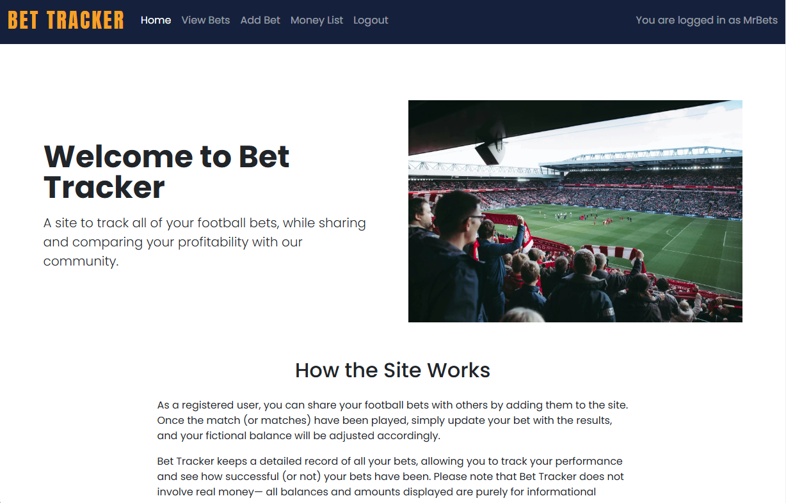
- Guide to Tracking Bets

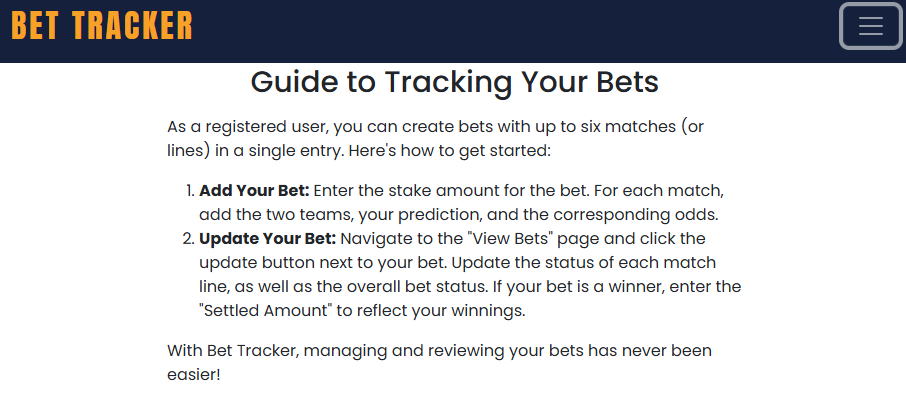

- Betting Guide

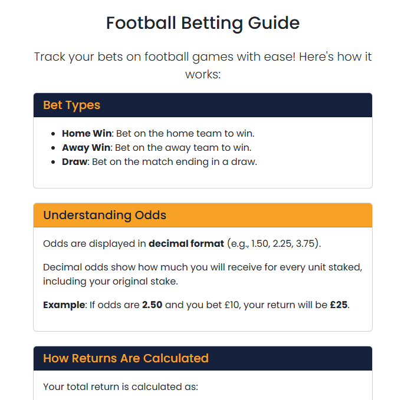

**Add A Bet**
One of the main reasons for visiting the site is to track the success of your own football bets, and this page is where the user is able to add their bets to the site. 
The page is intentionally kept very clean so that the important information is clearly visible and the user is not distracted. The user can add up to 6 matches (lines) in a single bet.
The details required for each line are:
 - Home Team: The team playing at home in the fixture
 - Away Team: The team playing away in the fixture
 - Your prediction: Choose from "Home" (Home team wins), "Away" (Away team wins), "Draw" (The teams draw)
 - Odds: The user enters the odds of their selection, usually taken from the betting site where they actually placed the bet.

By default, the match prediction of each line is set to "Home". 
<b>Validation</b>
 - Any bet must have a valid stake amount before the bet is saved. Minimum stake is 0.01.
 - Minimum odds for any line is 1.00. This is stated at the bottom of the page to assist the user. 
 - If a line has any team or odds data entered, it will be validated as a completed line. 
 - Home Team, Away Team and Odds must all be valid, or all be empty for the bet to save.

The "Save Bet" button is labelled clearly and is the only button on the page, so the user is guided with how to proceed.
Once saved successfully, the betting form is cleared and a confirmation message is displayed to the user.

I decided to allow bets with no lines to pass validation and be saved. This allows users the ability to update their betting balance (on the site) for any reason, without having to reference a football match.

The page is fully responsive and is readable on both mobile devices and large screens.

Click to view screenshots of the Add Bet page

Add a Bet Page
 
 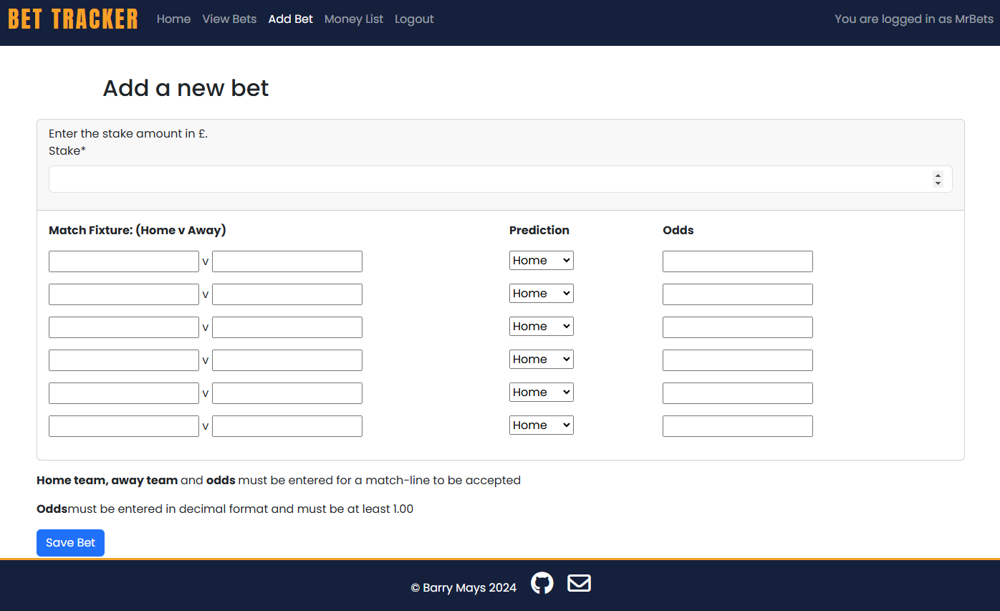

**View Bets**

At the top of the page are two links for the user to switch between two views. Open Bets and Settled Bets. 
Both pages are intentionally styled the same way so that while the list of bets and the information within changes, the page structure remains the same.
The links are styled to remind the user which page they are viewing.

Open Bets:
All open bets are displayed on this page. This includes bets placed by the current user, and other users on the site. The username of the bettor is distinctly displayed in each bet header. The bets are ordered by their modified date to keep the new additions and the recently updated as the most prominent at the top.
To keep the page from being too busy on the eye, I have implemented an accordion element for each bet so that the individual line detail can be hidden or displayed. The top five bets on the page are expanded by default - the rest are initially collapsed.
Each open bet displays the 'pending' status as a reminder to the users that these bets are for future matches.
Each individual match within the bet also has a status to reflect and display the success of each match prediction.

From this 'open bets' page, a user is presented with two buttons for each of their bets - Update and Delete. This is part of the CRUD functionality solution to allow a user to update or delete their bets. 
At the top of the page, the user's current bank balance is permanently displayed so there is no action for the user to search for it.

Click to view screenshot of the View Open Bets page

 - Open Bets Page
 
  - 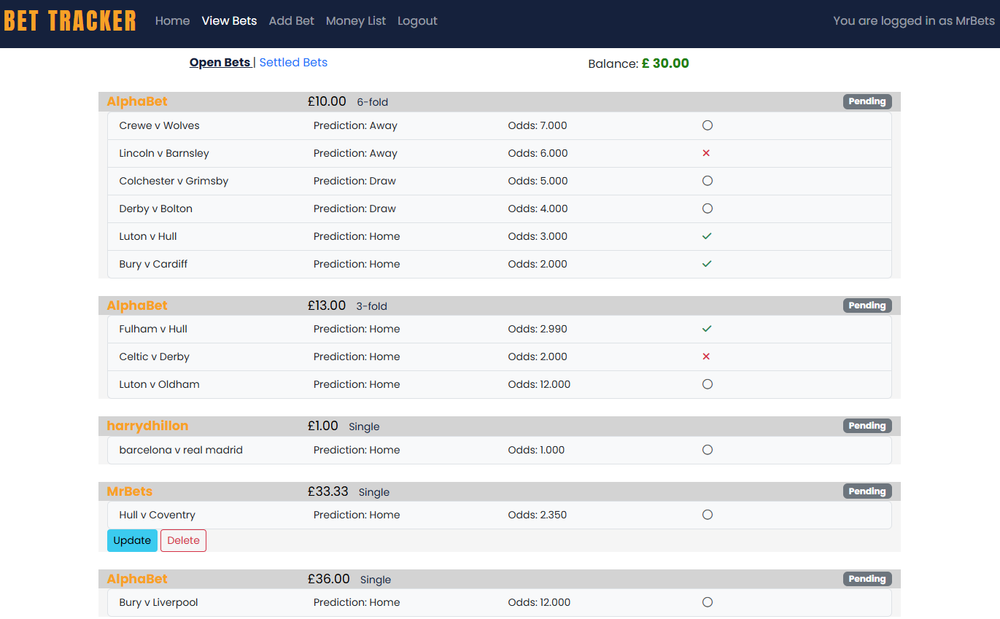

Settled Bets:
A bet moves from the open bets page to the settled bets page once it is saved / updated with a bet status that is no longer pending. 
All settled bets are similarly displayed in a single page and display the status (Win Or Lose).
Unlike the Open Bets view, the settled amount is displayed on this page as it is only relevant when the bet is settled. 

The page is fully responsive and is readable on both mobile devices and large screens.

Click to view screenshot of the View Settled Bets page

 - Settled Bets Page
 
 - 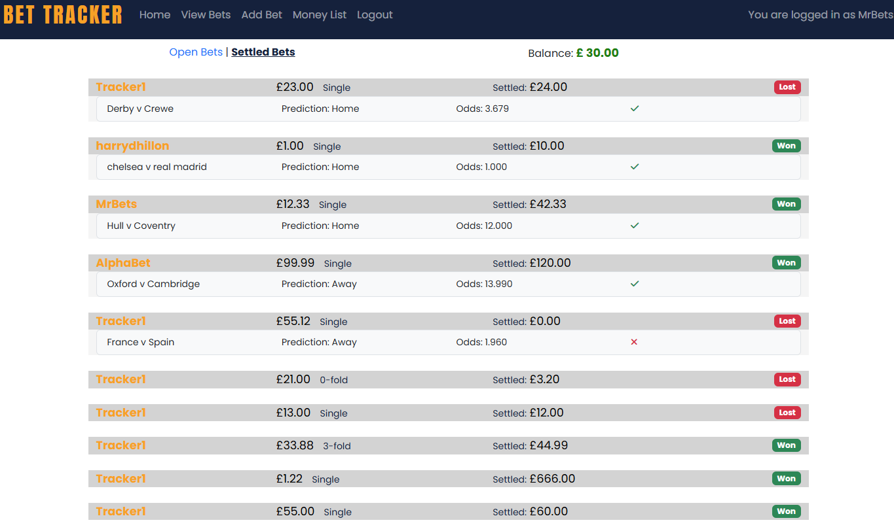

**Update Bet**

From the View Bets page, the user is presented with all open bets on the site. The bets are displayed in a single list with no pagination. This allows the user to easily scroll through to find what they are looking for. 
The Update Button is clearly visible on bets that the user has placed themselves. 
If clicked, the user is presented with the Update Bet screen.
Here the user can edit all fields associated with the bet. 
 - Stake: To correct an error with the stake previously entered.
 - Status: While the status is pending the bet remains 'open'. The user will update the status to reflect whether the bet was a winner or loser after the matches have been played. When the status is not pending, the bet will be considered 'settled'.
  - For a winning bet, the settled amount should be greater than the stake.
  - For a losing bet, the settled amount should be less than the stake.
  - For a bet where the settled amount is equal to the stake amount, 'Win' and 'Lose' are both valid statuses. 
 - Settled Amount: When the bet is settled, the user enters the amount that the bet returned. 

The text at the bottom of the page is dynamic and responds to changes in the bet status field, informing the user what will happen when they save the changes.
Javascript code controls which of the two buttons is enabled based on the status of the bet. I decided to implement two buttons to make it clear to the user that two different actions are possible from this screen:
1. Save changes. Update bet but the bet remains open and further changes can be made.
2. Settle & Close Bet. Save bet in the 'settled' status, where your balance will be updated and no more changes will be possible.

Using two distinct buttons and informative text guides the user. 
 - If saving the bet with a pending status, a modal is displayed confirming to the user what action took place what page loads next. The modal remains on the screen until the user closes it.
 - If the bet is settled, the user is redirected to the View Open Bets page and a message is displayed, confirming the action on the 'settled' bet.

Validation:
There is Javascript validation to check the status of the bet correctly reflects the settled amount compared to the stake.
- For a bet to win, the settled amount must not be lower than the stake amount
- For a bet to lose, the settled amount must not be lower than the stake amount
If the validation fails, both save buttons are disabled and text is displayed to the user to explain how to proceed.

Click to view screenshots of the Update Bet page

 - Update + Save Changes
 
 - 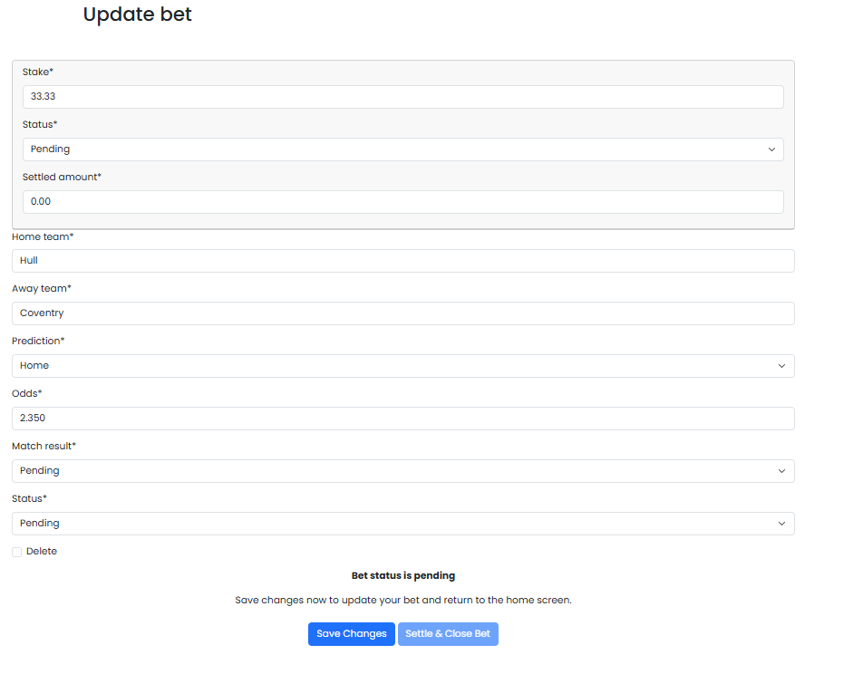
 
 - Update + Settle Bet
   
 - 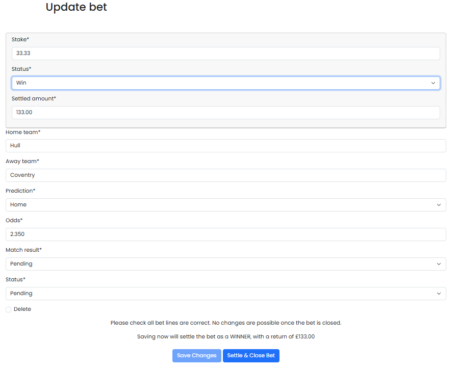
   
 - Settle Bet Text
   
 - 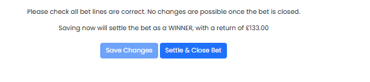

 - Buttons Disabled + Instruction
   
 - 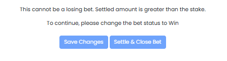
   
 - Save changes confirmation Modal
 
 - 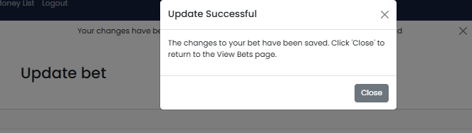
 

**Delete Bet**

From the View Bets > Open Bets page, the user is able to delete any of their own bets. This feature is only available on open bets. 
Once the bet is settled it can only be deleted by the site administrator. This is to ensure the settled bets page records a full history of settled bets. 

Click to view screenshots of the Delete Bet Modal

 
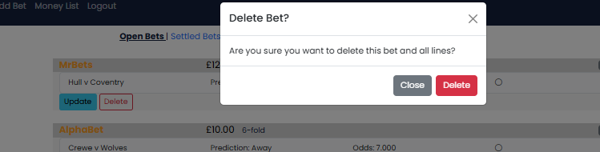

**Money List**

The money list page presents the user with an ordered list of all user's bank balances, ordered with the highest balance at the top.
This view utilises the Bank App in the Django project.
The leader at the top of the table is highted in green, and the user row is highlighted in blue (if not the leader).
Only users who have settled at least one bet will appear on this list.

Click to view screenshots of the Money List page

 
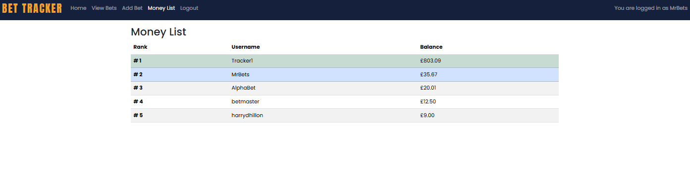

-----

## Technologies Used

### Languages

- HTML5
- CSS
- JavaScript
- Python

-----

### Libraries & Frameworks

* [Django 4.2.16](https://www.djangoproject.com/) - Free and open source Python Web Framework
* [Gunicorn 20.1.0](https://gunicorn.org/) - A Python WSGI HTTP server compatible with Django and used to run the project on Heroku
* PostgreSQL - An open-source object-relational database system
* [Pyscopg2 2.9.10](https://www.psycopg.org/docs/) - A PostgreSQL database adapter for Python
- [Heroku](https://www.heroku.com) - A cloud platform which hosts the website
- [SQLite3](https://docs.python.org/3/library/sqlite3.html) - The database provided by Django, used in testing
- [Django Allauth](https://django-allauth.readthedocs.io/en/latest/) - Integrated set of Django applications addressing authentication and registration
- [Bootstrap 5.3](https://getbootstrap.com/docs/5.3/getting-started/introduction/)
- Django Summernote 0.8.20.0 - For configuring and customising the administration menu
- Whitenoise 5.3.0 - for handling static files in deployment

### Tools

- [GitPod](https://www.gitpod.io/) - Cloud development environment used
- [GitHub](https://github.com/) - Cloud based git repository used, for storing the code and for the Agile project management.
- [W3C Validator](https://validator.w3.org/) - Used for HTML code validation
- [W3C CSS Validation Service](https://jigsaw.w3.org/css-validator/) - Used for CSS code validation
- [Code Institute's Python Linter](https://pep8ci.herokuapp.com/) - Used for Python code validation
- [Chrome DevTools and Lighthouse](https://developer.chrome.com/docs/devtools/) - Web Developer Tools
- [Am I responsive](https://ui.dev/amiresponsive) - For responsive visuals of the website, used in this readme
- [TinyPNG](https://tinypng.com/) - Used to compresses image to reduce the file size
- [Pexels](https://www.pexels.com/) - Source of the image on the home page
- [Google Fonts](https://fonts.google.com/) - Fonts
- [Font Awesome](https://fontawesome.com/) - Icons
- [Balsamiq](https://balsamiq.com/wireframes/) - Used to create Wireframes

-----

## Testing

All testing information is documented in TESTING.md

-----

## Deployment

### How to clone the project

Details

1. Log into Github
2. Go to the project repository at (https://github.com/bmays9/bet-tracker)
3. Click on the Code button and copy your preferred link.
4. Open the terminal in your code editor and change the working directory to the location you want to use for the cloned directory.
5. Type 'git clone' into the terminal, paste the link you copied and hit enter.

### How to fork the repository

Details

1. Login to Github.
2. Go to the project repository at (https://github.com/bmays9/bet-tracker)
3. Click the 'Fork' button.

### Code Institute PostgreSQL Database

Details

1. Create a [Code Institute PostgreSQL](https://dbs.ci-dbs.net/manage/KeeMR5RVAMT6WX8k/) account.
2. Create a new instance.
3. Copy the database URL.
4. Add database to the settings.py-file in Django.

  
### Deploying to Heroku

 Deploying to Heroku 

To install the Django framework installed and deploy to Heroku I followed the Code institutes [Django Blog cheatsheet](docs/django-blog-cheatsheet.pdf)

----- 

## Bugs

Code Validation Bugs

Click to view code validation errors and warnings

**HTML** 

- HTML index.html

- 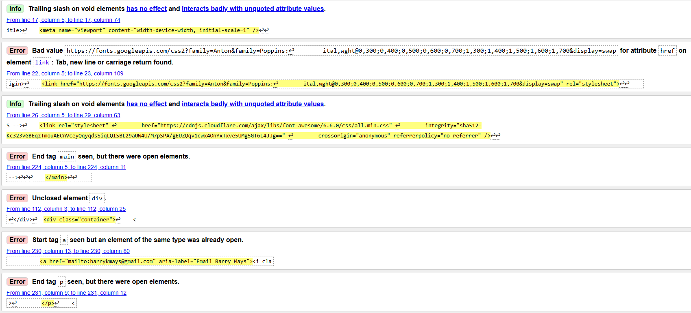

- HTML add_bet.html

- 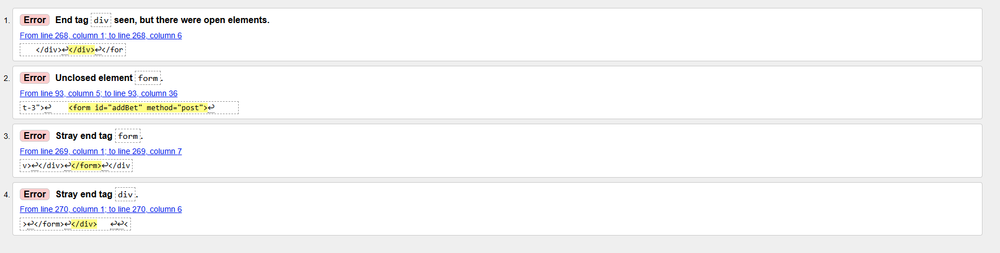

- HTML update_bet.html

- 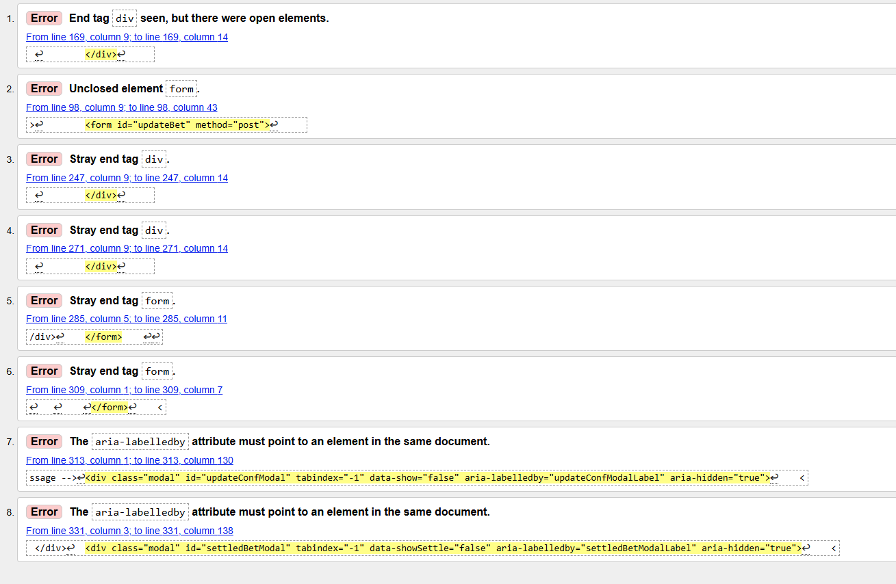

- HTML bets.html

- 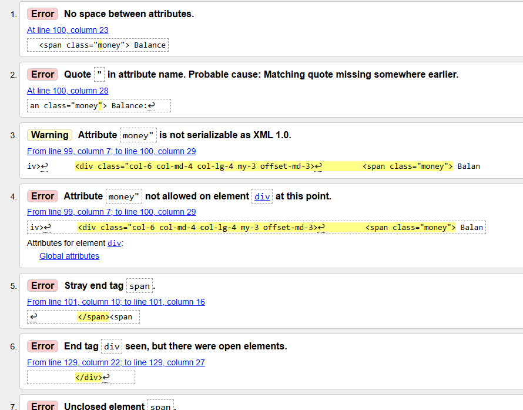

I was able to reformat and clean up the html code so that no errors were remaining.
The most common errors were caused by not closing tag elements correctly.

**Python**

- models.py errors

- 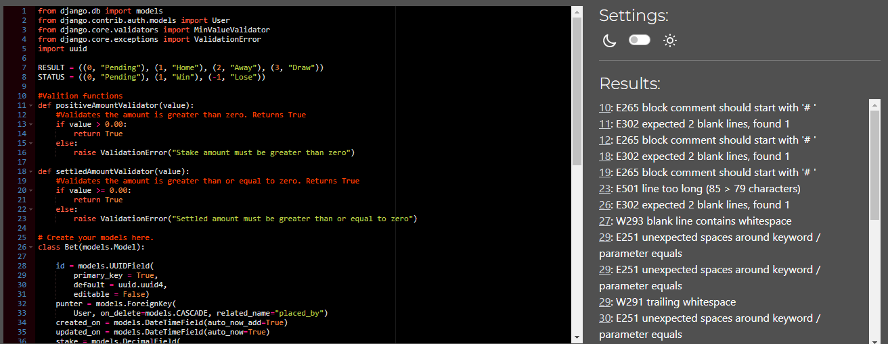

- forms.py errors

- 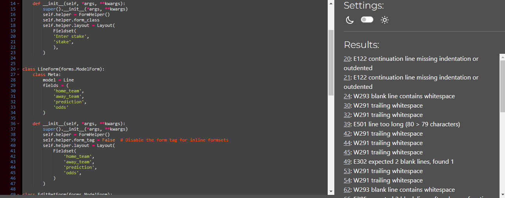

- test_forms.py errors

- 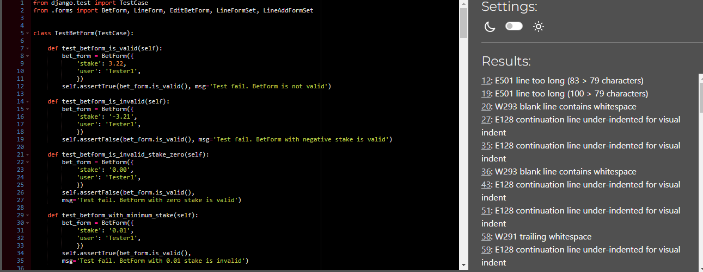

- views.py errors

- 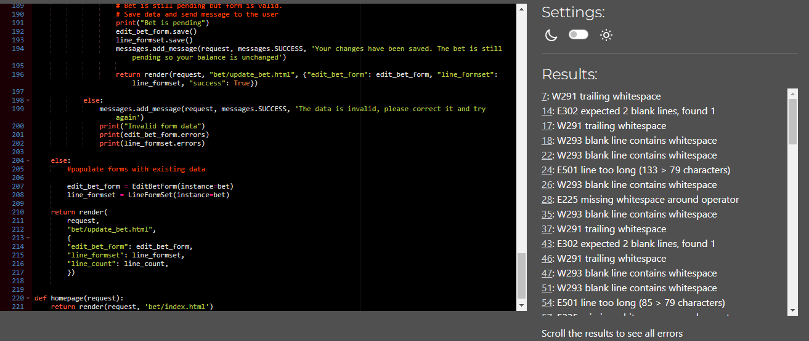

Click to view bug details

**Update Bet form loop error**

When testing updating bet containing 6 lines I found that the page was not rendering correctly. The last two line details were formatted differently from the previous four.

- 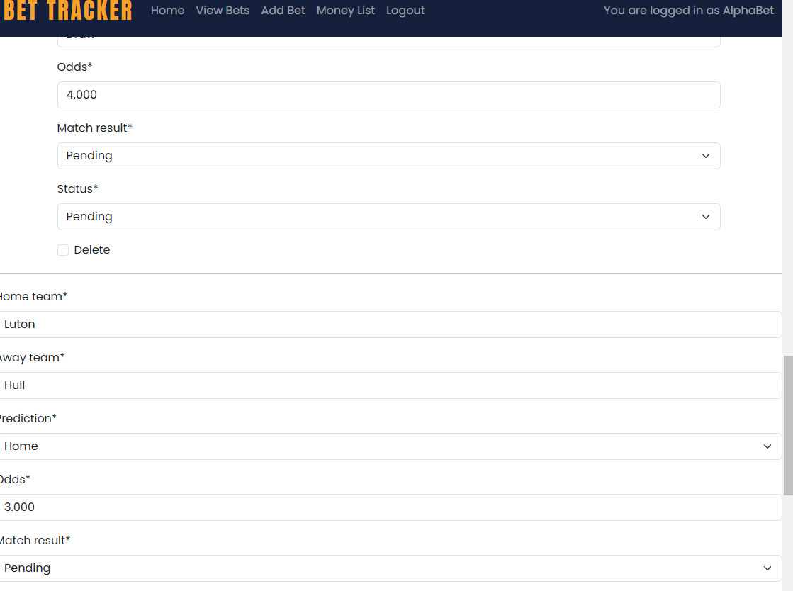

I found the source of the error was in the way the html tags were not looping correctly
within the crispy form code. The "card-body" class was outside of the for loop.

- 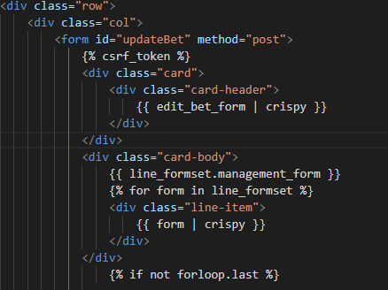

- I was able to fix this by reordering the code as follows:

- 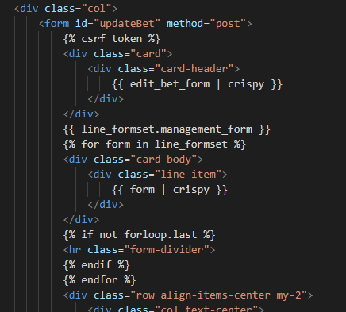

**New User Bank**

I encountered an error when a new user settled their first bet. There was no bank object created for the new user so trying to adjust their balance created an error.

This was resolved by adding some code in views.py to create a new instance of bank for the user if one did not already exist.

**First Bank Adjustment**

There was then an issue with the first settled bet when trying to adjust the new users balance. There was a type mismatch of decimal and float between the two fields:

- 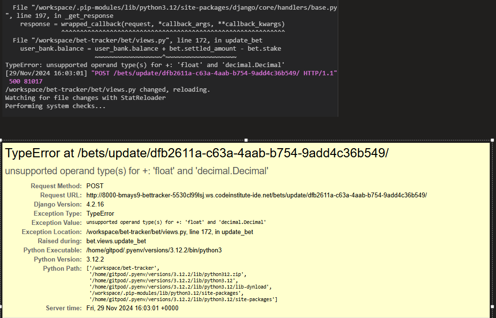

To fix this issue I added the conversion to Decimal of the initial 0.00 balance.

- 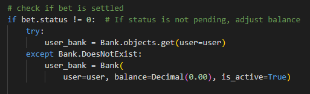

**Homepage**

On the HTML page, the fonts were not loading correctly due to splitting the google font code across two lines. This was rectified during code validation phase by putting the href link onto a single line.

----- 

## Credits

I relied on the Code Institute "I Think Therefore I Blog" walkthrough from the CI LMS system. This provided the structure and support for the project.

For form layouts I used the following to understand how to display formsets
 - https://stackoverflow.com/questions/21754918/rendering-tabular-rows-with-formset-in-django-crispy-forms
 - https://medium.com/@azzouzhamza13/django-crispy-forms-bootstrap5-00a1eb3ec3c7
 - https://django-crispy-forms.readthedocs.io/en/latest/layouts.html

To understand custom validators for my forms I used:
 - https://www.geeksforgeeks.org/custom-field-validations-in-django-models/

For user messages I used:
 - https://stackoverflow.com/questions/2053258/how-do-i-output-html-in-a-message-in-the-new-django-messages-framework/10124845#10124845

This was a help on various topics, particularly model relationships:
 - https://simpleisbetterthancomplex.com/

Bootstrap documentation was used a lot during the project:
- https://getbootstrap.com/docs/5.3/getting-started/introduction/

For guidance on the readme structure I used:
 - https://github.com/MoniPar/tailors_thimble/blob/main/README.md

-----

## Acknowledgements

- I would like to thank my mentor Harry Dhillon for the help and encouragement for this project. Harry's positive feedback gave me the reassurance that, despite time pressure, the project was not as bad as I feared. 
