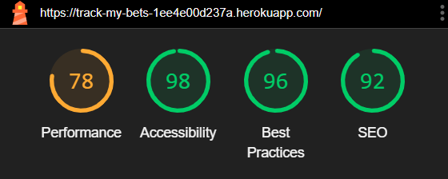
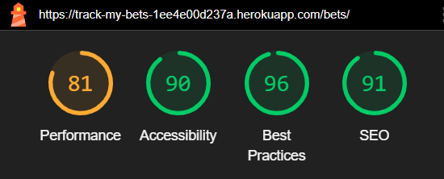
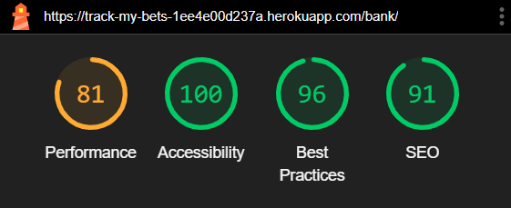

## Code Validation

### HTML
HTML code was tested using the [W3C Validator](https://validator.w3.org/) via text input.  The HTML code was copied and pasted in from each page of the website's source code.

**Homepage**

Document checking completed. No errors or warnings to show.

**View Bets**

Open Bets View - Document checking completed. No errors or warnings to show.
Settled Bets View - Document checking completed. No errors or warnings to show.

**Add Bet**

Document checking completed. No errors or warnings to show.

**Update Bet**

Document checking completed. No errors or warnings to show.

**Money List**

Document checking completed. No errors or warnings to show.

_____

### CSS

CSS code was tested using the [W3C CSS Validation Service](https://jigsaw.w3.org/css-validator/) via text input. 

**styles.css**

No Error Found
_____

### JavaScript

JavaScript code was tested using [JSHint](https://jshint.com/)

**deletebet.js**

One error was observed. One undefined variable
This error is expected due to cross referencing scripts and was therefore not eliminated.

**editbet.js**

One undefined variable observed. "17	bootstrap, 67	bootstrap"
This error is expected due to cross referencing scripts and was therefore not eliminated.

______

### Python

The Python code was tested using [Code Institute's Python Linter](https://pep8ci.herokuapp.com/).

Results for all Python files

____

**root**

* env.py

All clear, no errors found

____

**bettingtracker**

**settings.py**

Lines exceeding 79 characters were cleared using `# noqa`. 
These were values by the Django generated AUTH_PASSWORD_VALIDATORS and caused no issues being on a single line.
All clear, no errors found

**urls.py**

All clear, no errors found

____ 

**Bet App**

**admin.py**

All clear, no errors found

**apps.py**

All clear, no errors found

**forms.py**

All clear, no errors found

**models.py**

All clear, no errors found

**test_forms.py**

All clear, no errors found

**urls.py**

All clear, no errors found

**views.py**

All clear, no errors found

____

**Bank App**

**admin.py**

All clear, no errors found

**apps.py**

All clear, no errors found

**models.py**

All clear, no errors found

**views.py**

All clear, no errors found

_____

## Lighthouse testing

The live site was assessed for Performance, Accessibility, Best Practices, and SEO using Google Chrome's Lighthouse tool.

The results were good across all pages.

**Index Page**

**View Bets Page**

**Money List Page**

______

## Responsiveness Testing and Browser compatibility

The live site was tested on a variety of devices and screen widths.
 - Windows Desktop: 1920 x 1080 
 - Samsung Galaxy S23 Android
 - Apple Ipad 3
   
### Homepage
 - Page is responsive. No text is obscured on small screens. 

### View Bets
 - Page is responsive. No text is obscured on small screens.
   
### Add a Bet
 - Page is responsive. No text is obscured on small screens.
   
### Update Bet
 - Page is responsive. No text is obscured on small screens.
  
### Money List
 - Page is responsive. No text is obscured on small screens. 

_______

## User Story and Feature Testing

All tests are described in the following pdf document.

[User Story and Features Testing](documentation/user-story-and-features-testing.pdf)
